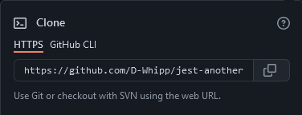

# Jest Another RPG
### Back End App

## Description
Welcome to Jest Another RPG. This Node game is written in JavaScript. It was a module from the [University of Arizona's Coding Bootcamp](https://bootcamp.ce.arizona.edu/coding/) where I earned my [certificate](https://arizona.badgr.com/public/assertions/gKrNffytTUe7WQTfPe3A7A). It's purpose was to deepen my understanding of Node.

## Table of Contents

- [Installation](#installation)
- [Usage](#usage)
- [License](#license)
- [Author](#author)
- [Badges](#badges)

## Installation

- Clone the source code.  
 
- Navigate to the projects root directory. 
- Run "npm i" to install dependencies. 

## Usage

- Run, from the projects root directory, run "node app.js"
- From there answer the prompts you see in your terminal.

## License

MIT License

Copyright (c) [2022] [David Whipple]

Permission is hereby granted, free of charge, to any person obtaining a copy of this software and associated documentation files (the "Software"), to deal in the Software without restriction, including without limitation the rights to use, copy, modify, merge, publish, distribute, sublicense, and/or sell copies of the Software, and to permit persons to whom the Software is furnished to do so, subject to the following conditions:

The above copyright notice and this permission notice shall be included in all copies or substantial portions of the Software.

THE SOFTWARE IS PROVIDED "AS IS", WITHOUT WARRANTY OF ANY KIND, EXPRESS OR IMPLIED, INCLUDING BUT NOT LIMITED TO THE WARRANTIES OF MERCHANTABILITY, FITNESS FOR A PARTICULAR PURPOSE AND NONINFRINGEMENT. IN NO EVENT SHALL THE AUTHORS OR COPYRIGHT HOLDERS BE LIABLE FOR ANY CLAIM, DAMAGES OR OTHER LIABILITY, WHETHER IN AN ACTION OF CONTRACT, TORT OR OTHERWISE, ARISING FROM, OUT OF OR IN CONNECTION WITH THE SOFTWARE OR THE USE OR OTHER DEALINGS IN THE SOFTWARE.

## Author

Hello! My name is David. 
Email is dwhipp88@gmail.com.  
[LinkedIn](https://www.linkedin.com/in/david-w-079841213/)  
If you're interested in seeing more of my work then check out my [portfolio](http://mighty-brook-32674.herokuapp.com/) or you can view my [github](https://github.com/D-Whipp). 

## Badges

